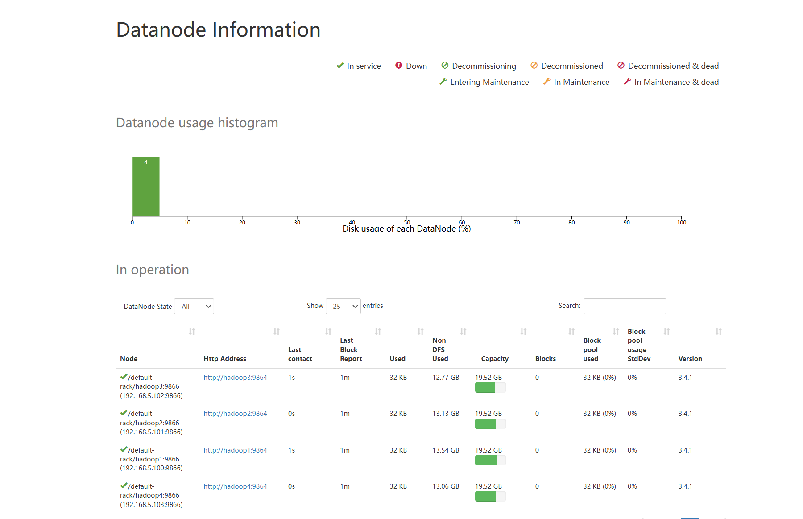

## Table of Contents
- [Background](#background)
- [Install](#install)
- [Usage](#Usage)
- [Maintainers](#maintainers)
- [License](#license)
## Background
YARN（Yet Another Resource Negotiato）是Hadoop集群的资源管理和调度系统，它负责为各种分布式计算任务分配和管理资源,包含以下组件：ResourceManager，NodeManager，ApplicationMaster， Container。
### YARN调度器和调度算法
Hadoop作业调度器主要有三种，分别是先进先出调度器(FIFO)、容量调度器(Capacity Scheduler)和公平调度器(Fair Scheduler), 在Hadoop3.1.3中， 默认的资源调度器是容量调度器，CDH 框架默认调度器是公平调度器。
**FIFO 调度器（First In First Out）**：一个队列根据作业提交的先后顺序，先来先服务。
**容量调度器**
容量调度器是Yahoo开发的多用户调度器，它支持多队列，每个队列可以配置一定的资源量。
**与容量调度器的区别**

**调度策略不同**
容量调度器：优先选择资源利用率低的队列分配资源。
公平调度器：优先选择资源缺额比例大的队列分配资源。

**队列资源分配方式不同**
容量调度器：FIFO、 DRF
公平调度器：FIFO、FAIR、DRF
公平调度器的资源分配策略

1）FIFO策略

公平调度器若采用此策略就相当于容量调度器。

2）Fair策略（默认的实现方式）

Fair基于公平算法分配资源，若一个队列中有两个应用程序同时运行，则每个应用程序可得到1/2的资源，如果有三个应用程序同时运行，则每个应用程序可得到1/3的资源。

资源的分配流程和容量调度器一致，按照队列，作业，容器的顺序分配，每一步都是按照公平策略分配资源。

## Install

### 安装环境

实验环境：四台虚拟机节点

操作系统：Ubuntu 24.04.1 amd64

集群环境：Hadoop 3.4.1,Spark 3.5.3

确保集群中所有OS安装以下基础软件配置

| 软件环境                     | 版本号                 |
| ---------------------------- | ---------------------- |
| Python                       | 3.12.0                 |
| Scala                        | 3.4.1                  |
| ssh(远程调用工具)            | lastest（apt命令安装） |
| ifconfig（网络配置查看工具） | lastest（apt命令安装） |
| Java                         | open-jdk21             |

### 安装步骤

1、配置集群网络环境

  首先，确保集群在统一局域网下，这里配置虚拟局域网并配置节点的静态IP

  以hadoop1节点为例，在  /etc/netplan/50-cloud-init.yaml中关闭dhcp,写入静态ip地址，虚拟局域网的网关ip，并配置dns


  在 /etc/hosts文件中配置集群所有节点的ip地址


  完成后使用相关命令更新配置信息，并使用Ping命令测试

2、配置节点远程调用

  首先配置SSH免密码登录，通过免密登录各个节点可以访问其他节点而不需要输入密码验证。 在节点1上输入ssh-keygen -t rsa

指令生成密钥，默认会在~/.ssh/文件夹下生成公钥文件id_rsa.pub和私钥文件id_rsa。

  通过下面的命令将公钥文件发送到本机，创建 root 免密钥通道(需要输入root 密码 ) :

```
ssh-copy-id  -i  /root/.ssh/id_rsa.pub  root@hadoop1
```

  通过下面的命令将公钥文件发送到节点2,创建root 免密钥通道(需要输入root 密码 ) :

```
ssh-copy-id  -i  /root/.ssh/id_rsa.pub   root@hadoop2
```

  通过下面的命令将公钥文件发送到节点3,创建root 免密钥通道(需要输入 root 密码 ) :

```
ssh-copy-id  -i  /root/.ssh/id_rsa.pub   root@hadoop3
```

   通过下面的命令将公钥文件发送到节点4创建root 免密钥通道(需要输入 root 密码 ) :

```
ssh-copy-id  -i  /root/.ssh/id_rsa.pub   root@hadoop4
```

 依次在节点2，节点3和节点4上生成密钥，并将公钥发送到本机及其他节点。

3、配置Haddop和Spark集群

在官网下载Hadoop安装包，解压并放置在/usr/local/hadoop文件夹下

在官网下载Spark安装包，解压并放置在/usr/local/spark文件下

首先在/etc/proflie文件中修改环境变量信息


4、修改配置文件信息，这里篇幅较长不过多赘述，可以将github中的文件夹分别复制到hadoop和spark文件夹下

这里需要在hadoop文件夹下创建一个hadoop文件夹，在下面分别创建tmp,name,data文件夹

需要注意，部署完成后使用scp命令将所有配置文件同步到其他节点。

5、启动spark和hadoop集群

运行如下命令，启动集群

```
/usr/loacal/hadoop/sbin/start-all.sh
/usr/loacal/spark/sbin/start-all.sh
```

下面是关闭集群的命令

```
/usr/loacal/spark/sbin/stop-all.sh
/usr/loacal/hadoop/sbin/stop-all.sh
```

6、验证是否部署成功

查看http://hadoop1:50070 Web页面(客户端也在同一局域网内),可以看到节点全部启动



使用jps命令查看当前进程，可以看到hadoop和spark组件启动成功

主节点


从节点


## Usage 
### 研究目的
随着大数据技术的发展，资源管理和任务调度在分布式计算框架中的作用愈发重要。Apache YARN（Yet Another Resource Negotiator）作为 Hadoop 生态系统的资源管理器，提供了多种调度策略来满足不同场景下的资源分配需求，包括 FIFO 调度器、Capacity 调度器 和 Fair 调度器。
本研究的目的是通过实验对比这三种调度策略在 资源分配公平性、任务完成时间 和 资源利用率 等方面的性能表现，探讨不同调度器在各种负载条件下的适用性和优缺点，为分布式任务调度策略的选择提供理论支持和实践依据。
### 研究方法
### 初步实验
使用四个队列，CAPACITY即资源划分为 10，20，30，40


### 参数maximumCAPACITY和CAPACITY
maximum-capacity 是一个参数，用于定义 队列能够使用的最大资源容量，以百分比的形式表示。它主要用于 Capacity Scheduler 中，用来管理集群资源的分配。

max-capacity 的作用
限制某个队列的最大资源占用比例：
每个队列可以使用的资源不会超过 max-capacity 指定的百分比，即使集群中有剩余资源。
它通常用来避免某个队列独占资源，影响其他队列的任务运行。
capacity表示默认容量，而maximum—capacity表示最大容量上限即队列能够抢占之后的最大容量上限。

maximum-capacity为100，允许借用其它资源，只提交作业提交在第一个队列  占用为166.7%，证明向其它队列借用资源，达到了他本身拥有资源的166.7%，
运行时间为1min。


修改queue1的maxcapacity为50，观察其运行时间


当MAX CAPACITY为50时，运行时间约为3min，即：队列的总可调度资源影响作业执行效率


### 
向队列2提交四个并行任务


QUEUE2的占用超过100%，证明从其它队列借用空闲资源


查看任务提交和完成的顺序，得出队列任务调度执行FIFO


### 研究capacity中的优先级：

设置最大优先级为3


### 将队列设置为两个，资源分配为30%和70%，并指定优先级为2和1，
即将first队列设置较少的资源但是较高的优先级，second队列较多的资源但是较低的优先级。


可以看到，在任务运行过程中first队列在资源紧张时抢占了second队列的资源。
### 队列优先级的特点
#### 相对优先级：
队列的优先级是相对的，数值越高，表示优先级越高。
当资源不足时，优先级高的队列会比低优先级的队列更快地获取可用资源。
#### 配置优先级：
每个队列都可以设置一个整数值作为优先级。
优先级设置的默认值是 0，表示无特殊优先级。
#### 仅在资源紧张时生效
如果集群有足够的资源，队列优先级不会影响资源分配。
当资源稀缺时，优先级高的队列会优先得到调度。
#### 跨队列调度规则
队列的优先级适用于多个队列间的资源分配，而不适用于同一队列中的任务。


在YARN的调度策略中，如果某个队列有空闲资源，它通常不应该去占用高优先级队列的资源，尤其是在没有特定的资源共享机制下。一般来说，调度器会根据队列的配置优先级来分配资源。如果低优先级队列有空闲资源，资源通常会被保留在该队列内，直到有新的任务提交或者资源被其他任务请求。

### 资源分配的基本原则：

1. **高优先级队列优先**：调度器会优先考虑高优先级队列的作业，如果资源不足，高优先级的队列会阻塞，直到资源可用。
2. **空闲资源的使用**：低优先级队列的空闲资源不会自动占用高优先级队列的资源。通常情况下，低优先级队列的空闲资源只会在其他队列未使用时被填充，而不是主动抢占高优先级队列的资源。

### 例外情况：

- **抢占**：在一些特定的配置下，YARN可能会支持抢占机制，允许低优先级的作业在高优先级队列资源空闲的情况下占用这些资源。这个通常依赖于YARN的调度器（如Capacity Scheduler）配置中的`fairness`或`preemption`策略。
- **Fair调度**：如果启用了Fair调度器，则所有队列会根据资源需求进行动态资源分配，资源在队列之间按照需要公平地分配，而不仅仅是按照优先级分配。

总的来说，默认情况下，低优先级队列不会自动占用高优先级队列的空闲资源，除非系统配置允许某些特殊的资源共享或抢占策略。

将三个作业同时运行在firstqueue


将三个作业运行在first,second,third queue中


## Maintainers
[@nekoder](https://github.com/nekoder2002)  <br>
[@He Feixiang](https://github.com/1BrianHe1) <br>
[@Bert](https://github.com/aibert2) <br>
[@rookieC511](https://github.com/rookieC511)
### 小组分工
盛鼎贡献25%，负责实验环境搭建，实验1
贺飞翔贡献25%，负责实验环境搭建，实验1，2，3。
常城贡献25%，负责实验2，3，github仓库建立和上传。
蔺柏臣贡献25%，负责实验2，3，ppt制作。
### 实验结果
**FIFO 调度器**
适合简单、单一任务场景，资源分配快速，但无法动态调整，任务完成时间较长，资源公平性较差。
**Capacity 调度器**
适合多队列、多租户环境，资源分配灵活，可设置队列容量，但配置复杂，调度延迟较高。
**Fair 调度器**
资源分配最公平，动态性和资源利用率最高，特别适用于高负载和混合任务场景，但调度逻辑相对复杂，延迟略高于 FIFO。
## Contributing
## License
[MIT](LICENSE) © Richard Littauer
