## 使用四个队列，资源划分为 10，20，30，40

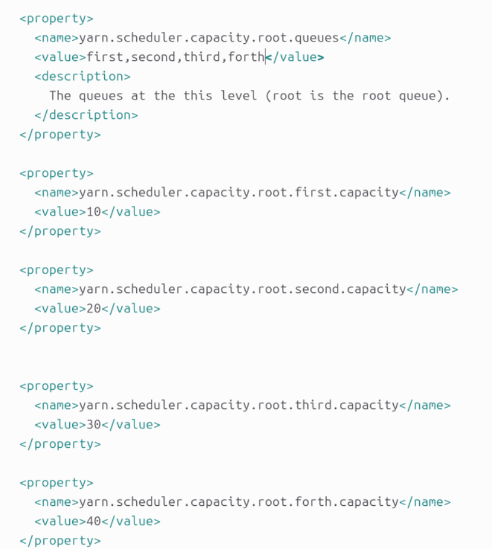

# maxcapacity为100，允许借用其它资源，只提交作业提交在第一个队列  占用为166.7%，证明向其它队列借用资源，运行时间为1min

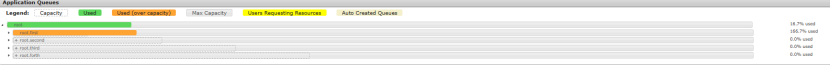

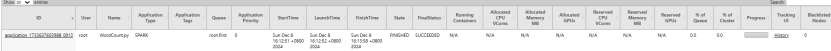

# 修改queue1的maxcapacity为50，观察其运行时间

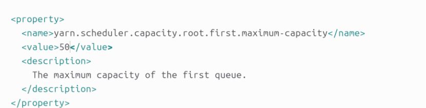

# 当MAX CAPACITY为50时，运行时间约为3min，即：队列的总可调度资源影响作业执行效率

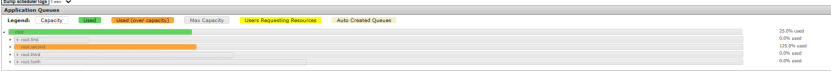

# 向队列2提交四个并行任务

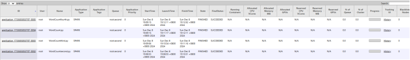

QUEUE2的占用超过100%，证明从其它队列借用空闲资源

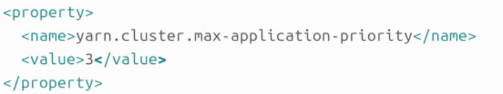

查看任务提交和完成的顺序，得出队列任务调度执行FIFO

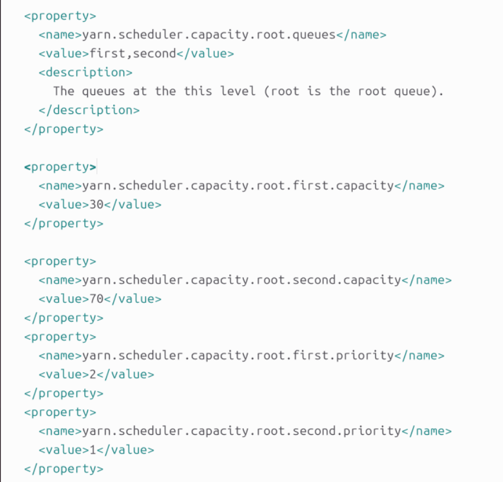

# 研究capacity中的优先级：

## 设置最大优先级为3

## 将队列设置为两个，资源分配为30%和70%，并指定优先级为2和1

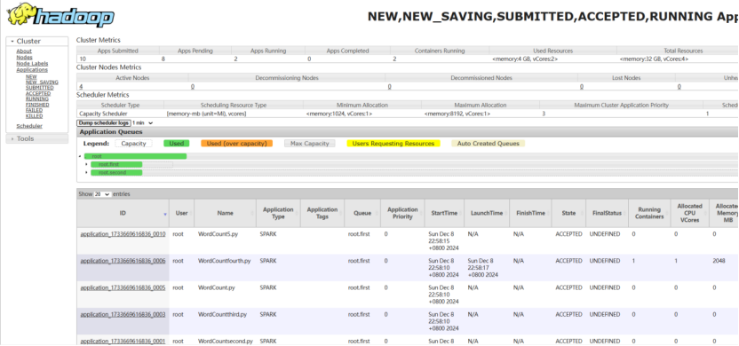

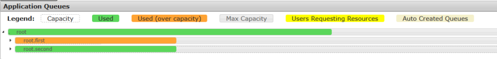

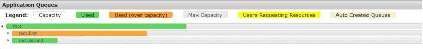

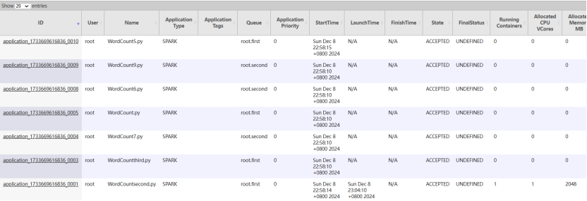

在YARN的调度策略中，如果某个队列有空闲资源，它通常不应该去占用高优先级队列的资源，尤其是在没有特定的资源共享机制下。一般来说，调度器会根据队列的配置优先级来分配资源。如果低优先级队列有空闲资源，资源通常会被保留在该队列内，直到有新的任务提交或者资源被其他任务请求。

### 资源分配的基本原则：

1. **高优先级队列优先**：调度器会优先考虑高优先级队列的作业，如果资源不足，高优先级的队列会阻塞，直到资源可用。
2. **空闲资源的使用**：低优先级队列的空闲资源不会自动占用高优先级队列的资源。通常情况下，低优先级队列的空闲资源只会在其他队列未使用时被填充，而不是主动抢占高优先级队列的资源。

### 例外情况：

- **抢占**：在一些特定的配置下，YARN可能会支持抢占机制，允许低优先级的作业在高优先级队列资源空闲的情况下占用这些资源。这个通常依赖于YARN的调度器（如Capacity Scheduler）配置中的`fairness`或`preemption`策略。
- **Fair调度**：如果启用了Fair调度器，则所有队列会根据资源需求进行动态资源分配，资源在队列之间按照需要公平地分配，而不仅仅是按照优先级分配。

总的来说，默认情况下，低优先级队列不会自动占用高优先级队列的空闲资源，除非系统配置允许某些特殊的资源共享或抢占策略。

将三个作业同时运行在firstqueue

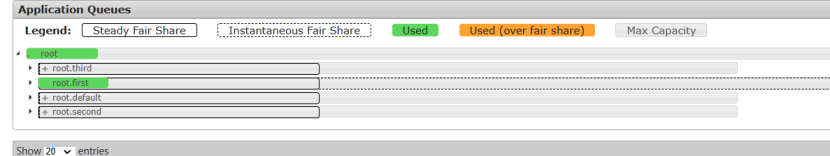

将三个作业运行在first,second,third queue中

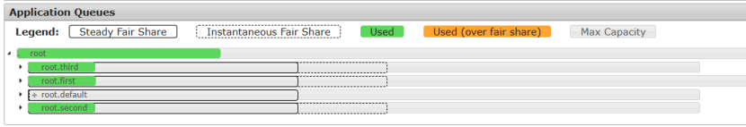
