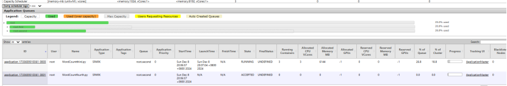

## Table of Contents

- [Background](#background)
- [Install](#install)
- [Usage](#Usage)
- [Maintainers](#maintainers)
- [Contributing](#contributing)
- [License](#license)
## Background

## Install

### 安装环境

实验环境：四台虚拟机节点

操作系统：Ubuntu 24.04.1 amd64

集群环境：Hadoop 3.4.1,Spark 3.5.3

确保集群中所有OS安装以下基础软件配置

| 软件环境                     | 版本号                 |
| ---------------------------- | ---------------------- |
| Python                       | 3.12.0                 |
| Scala                        | 3.4.1                  |
| ssh(远程调用工具)            | lastest（apt命令安装） |
| ifconfig（网络配置查看工具） | lastest（apt命令安装） |
| Java                         | open-jdk21             |

### 安装步骤

1、配置集群网络环境

  首先，确保集群在统一局域网下，这里配置虚拟局域网并配置节点的静态IP

  以hadoop1节点为例，在  /etc/netplan/50-cloud-init.yaml中关闭dhcp,写入静态ip地址，虚拟局域网的网关ip，并配置dns


  在 /etc/hosts文件中配置集群所有节点的ip地址


  完成后使用相关命令更新配置信息，并使用Ping命令测试

2、配置节点远程调用

  首先配置SSH免密码登录，通过免密登录各个节点可以访问其他节点而不需要输入密码验证。 在节点1上输入ssh-keygen -t rsa

指令生成密钥，默认会在~/.ssh/文件夹下生成公钥文件id_rsa.pub和私钥文件id_rsa。

  通过下面的命令将公钥文件发送到本机，创建 root 免密钥通道(需要输入root 密码 ) :

```
ssh-copy-id  -i  /root/.ssh/id_rsa.pub  root@hadoop1
```

  通过下面的命令将公钥文件发送到节点2,创建root 免密钥通道(需要输入root 密码 ) :

```
ssh-copy-id  -i  /root/.ssh/id_rsa.pub   root@hadoop2
```

  通过下面的命令将公钥文件发送到节点3,创建root 免密钥通道(需要输入 root 密码 ) :

```
ssh-copy-id  -i  /root/.ssh/id_rsa.pub   root@hadoop3
```

   通过下面的命令将公钥文件发送到节点4创建root 免密钥通道(需要输入 root 密码 ) :

```
ssh-copy-id  -i  /root/.ssh/id_rsa.pub   root@hadoop4
```

 依次在节点2，节点3和节点4上生成密钥，并将公钥发送到本机及其他节点。

3、配置Haddop和Spark集群

在官网下载Hadoop安装包，解压并放置在/usr/local/hadoop文件夹下

在官网下载Spark安装包，解压并放置在/usr/local/spark文件下

首先在/etc/proflie文件中修改环境变量信息


4、修改配置文件信息，这里篇幅较长不过多赘述，可以将github中的文件夹分别复制到hadoop和spark文件夹下

这里需要在hadoop文件夹下创建一个hadoop文件夹，在下面分别创建tmp,name,data文件夹

需要注意，部署完成后使用scp命令将所有配置文件同步到其他节点。

5、启动spark和hadoop集群

运行如下命令，启动集群

```
/usr/loacal/hadoop/sbin/start-all.sh
/usr/loacal/spark/sbin/start-all.sh
```

下面是关闭集群的命令

```
/usr/loacal/spark/sbin/stop-all.sh
/usr/loacal/hadoop/sbin/stop-all.sh
```

6、验证是否部署成功

查看http://hadoop1:50070 Web页面

使用jps命令查看当前进程

## Usage 

### 使用版本
以下指南将帮助你在本地机器上安装和运行该项目，进行开发和测试。关于如何将该项目部署到在线环境，请参考部署小节

### 部署

### 初步实验
使用四个队列，资源划分为 10，20，30，40


### 参数MAX CAPACITY
maxcapacity为100，允许借用其它资源，只提交作业提交在第一个队列  占用为166.7%，证明向其它队列借用资源，运行时间为1min


修改queue1的maxcapacity为50，观察其运行时间


当MAX CAPACITY为50时，运行时间约为3min，即：队列的总可调度资源影响作业执行效率


### 
向队列2提交四个并行任务


QUEUE2的占用超过100%，证明从其它队列借用空闲资源


查看任务提交和完成的顺序，得出队列任务调度执行FIFO


### 研究capacity中的优先级：

设置最大优先级为3


### 将队列设置为两个，资源分配为30%和70%，并指定优先级为2和1




在YARN的调度策略中，如果某个队列有空闲资源，它通常不应该去占用高优先级队列的资源，尤其是在没有特定的资源共享机制下。一般来说，调度器会根据队列的配置优先级来分配资源。如果低优先级队列有空闲资源，资源通常会被保留在该队列内，直到有新的任务提交或者资源被其他任务请求。

### 资源分配的基本原则：

1. **高优先级队列优先**：调度器会优先考虑高优先级队列的作业，如果资源不足，高优先级的队列会阻塞，直到资源可用。
2. **空闲资源的使用**：低优先级队列的空闲资源不会自动占用高优先级队列的资源。通常情况下，低优先级队列的空闲资源只会在其他队列未使用时被填充，而不是主动抢占高优先级队列的资源。

### 例外情况：

- **抢占**：在一些特定的配置下，YARN可能会支持抢占机制，允许低优先级的作业在高优先级队列资源空闲的情况下占用这些资源。这个通常依赖于YARN的调度器（如Capacity Scheduler）配置中的`fairness`或`preemption`策略。
- **Fair调度**：如果启用了Fair调度器，则所有队列会根据资源需求进行动态资源分配，资源在队列之间按照需要公平地分配，而不仅仅是按照优先级分配。

总的来说，默认情况下，低优先级队列不会自动占用高优先级队列的空闲资源，除非系统配置允许某些特殊的资源共享或抢占策略。

将三个作业同时运行在firstqueue


将三个作业运行在first,second,third queue中


## Maintainers
[@nekoder](https://github.com/nekoder2002) <br>
Feixiang,He 2027245102@qq.com <br>
Bochen,Lin linbochen2002@163.com <br>
[@rookieC511](https://github.com/rookieC511)
## Contributing
## License
[MIT](LICENSE) © Richard Littauer
